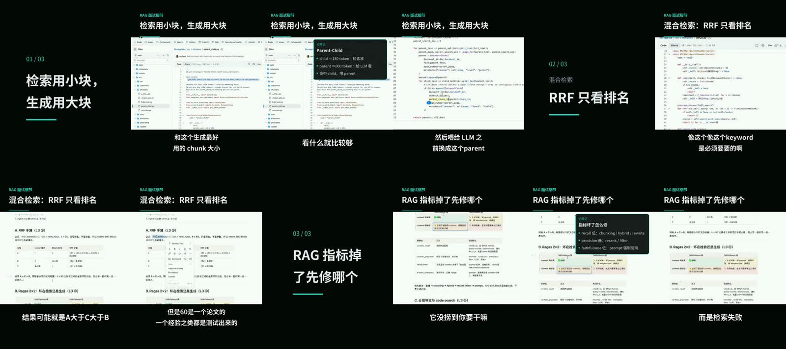
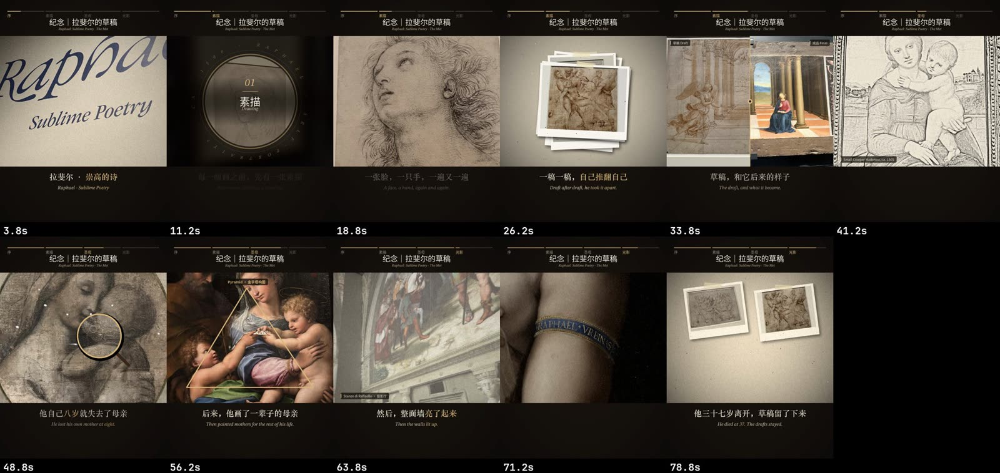
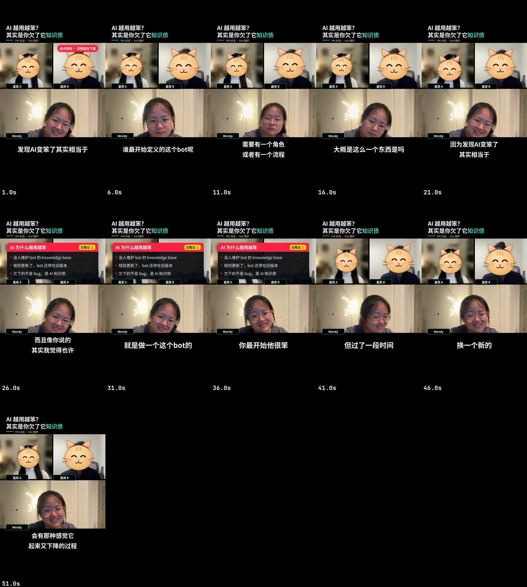

# video-studio

One **Claude Code skill** for every kind of video edit: talking-head shorts, long recordings cut into episodes,
call/interview clips with privacy masking, premium promo recuts, photo stories with effects, B-roll vlogs and
3Blue1Brown-style explainers, plus covers, music, loudness, captions and publish copy for 小红书 / YouTube / B站.

You talk to Claude ("cut the 气口 and speed it up 1.3×", "add a split screen with this screenshot and highlight the
prompt", "make it 10 minutes, bilingual subtitles, 3b1b style"); the skill tells Claude which workflow to run and
gives it tested scripts and a shared library to do it.


<sub>Frames from six demo edits made end to end with this skill; contact sheets below.</sub>

## What it covers

| Workflow | Turns… into… |
|---|---|
| `talkinghead` | 口播 recordings → tight short: 气口/filler/repeat removal (the shared cleanup tool), speed, captions, punch-ins, pop words, stamps, 记笔记 panels, progress bar, hooks, B-roll (cut-away / PiP / split screen / scrolling screenshot cards), retouch, cover, post copy. Raw vertical phone clips, or raw horizontal webcam / camera footage reframed to 9:16 (face-tracked) or kept 16:9 with a landscape layout; legacy 剪映 horizontal exports with burned subtitles |
| `promo-recut` | talking head + screenshots/links/another video → premium promo: split screen, 3D screenshot cards with highlighter, freeze-and-enlarge, inserted highlight reel; 16:9 or platform-laid-out vertical |
| `longform-to-short` | lectures, webinars, livestreams, screen-shares → cut course video and/or N short episodes with chapters, code zooms, covers, 发布包; **vertical slices** (3:4 / 9:16, speaker band or title band, readable code crops) |
| `call-clips` | Zoom / Meet / Teams / interviews → clips in vertical, trio or landscape layouts, face masking (stickers) and name-label blur |
| `photo-story` | photos + narration script → effect-rich story (17 shot types, 11 overlays, 12 transitions, film looks), 3:4 / 9:16 / 16:9; **music-only mode** cut on bars; narration by OpenAI TTS or **your own cloned voice** (Qwen3-TTS, local) |
| `vlog` | B-roll (drone, travel, phone) → `calm` (graded, crossfaded, per-segment speed, music) or **`fun`** (cut to the beat, speed ramps inside shots, true slow-mo, whips/flash/leaks, text pops, map card, SFX cue sheet, ducked music, speech clips with captions and gentle 气口/filler cleanup) |
| `explainer` | a topic → 3Blue1Brown-style animated explainer with AI narration and bilingual subtitles; 16:9 long form or **vertical short** (9:16 / 3:4) |
| `polish` | any exported edit → optional 气口/filler cleanup (`--cleanup`, off by default), cover on first frame, −14 LUFS (or the platform's target), speed-up, delivery tags; one or many platforms |
| `ai-video` | a script or idea → AI-generated video (可灵 Kling via MCP, Seedance/即梦, MiniMax): character bible, per-model prompts, dry-run credit plan with a budget cap, take review, assembly, multi-platform 投稿 packages; uploads only after a per-post confirmation |
| `cover`, `slides`, `preproduction` | covers/thumbnails per platform size, square or full-canvas slides, script writing + lint per platform + pronunciation drills |

Shared across workflows:

- **Speech cleanup (去气口 / filler / 重复 / 口误)**: one tool for every workflow that keeps original speech
  (`python -m vstudio.cleanup`): analyze → review sheet → you reply 「确认 3,5,9 / 保留 7」 → word-safe, frame-exact
  apply → re-ASR verify that no content word was lost. Profiles `gentle` / `standard` / `tight`; see
  [`references/CLEANUP.md`](references/CLEANUP.md).
- **Platform profiles + multi-platform export**: one clean master → per-platform files with captions placed for each
  app's UI, loudness, covers and a manifest (`python -m vstudio.export`; see Platforms below).
- **Reframe**: face-tracked virtual camera (One Euro smoothing, dead zone, eased pans) between any aspect ratios.
- **Beats / 卡点 and SFX**: beat grid + downbeats + sections (`vstudio.beats`), SFX cue sheets snapped to cuts and
  beats (`audio.cue_sheet_for`), synthesized SFX bank; see [`references/SOUND.md`](references/SOUND.md).
- **Effects registry**: 87 effects (190 counting named variants) in one declarative catalogue
  (`lib/vstudio/effects.py` → generated [`references/EFFECTS.md`](references/EFFECTS.md)); 24 transitions that work in
  HyperFrames, ffmpeg and per-frame PIL (`vstudio.xfade`). Add your own: [`references/ADDING_EFFECTS.md`](references/ADDING_EFFECTS.md).
- **Retouch v2**: MLS reshape, three-band skin smoothing, glasses-aware masks, makeup presets (`natural`, `daily`
  rosy-pink lip, `glam`); temporally stable on video with subtle makeup on by default and a `fast` preset for long
  videos ([`references/RETOUCH.md`](references/RETOUCH.md)).

What was tested on real footage, and the known limits: [`references/VALIDATION.md`](references/VALIDATION.md).

## What to say: example prompts

Talk to Claude in plain language (中文 or English); point it at your files. A few that work well:

| You want | Say something like | Workflow |
|---|---|---|
| Tight 口播 short | 「把这个口播剪一下：去气口、去口头禅和重复，1.1倍速，加字幕、记笔记、进度条，发小红书」 | `talkinghead` (+ `cleanup`) |
| Just clean the speech | 「这段录音去气口、去嗯啊和重复，不确定的列给我确认」 / 「剪映导出的这条再去一下气口」 | `cleanup` (any workflow) / `polish --cleanup` |
| Hook / 高光预告 | 「开头加 3 句高光预告，关键词弹字，再出一个抖音和 Shorts 版本」 | `talkinghead` + `export` |
| Retouch | 「帮我磨皮加个淡妆，封面再 P 瘦一点」 | `talkinghead` / `cover` |
| Long video → episodes | 「这个 70 分钟的课切成 3 条竖屏短视频，每条一个知识点，代码放大，带封面和发布文案」 | `longform-to-short` |
| Podcast / call clip | 「从这个 Zoom 播客里找一段最有意思的 1 分钟，嘉宾遮脸、名字打码，竖屏」 | `call-clips` |
| Premium promo | 「左右分栏，截图做 3D 卡片加高光，说到那句停 2 秒把 prompt 放大，后面插精选片段 1.1 倍速」 | `promo-recut` |
| Art / photo story | 「用这些展览照片做一个文艺片，纯音乐，分三章，草稿和成品对比、放大镜、胶片质感」 | `photo-story` |
| Fun travel vlog | 「迪士尼照片和片段剪一个快节奏卡点 vlog，DAY 标签、地点、音效、弹字，9:16」 | `vlog` (fun) |
| Calm vlog | 「这些航拍剪一个舒缓的 vlog，调色、慢速、配轻音乐」 | `vlog` (calm) |
| Explainer | "Make a 3Blue1Brown-style explainer on how CUDA runs on a GPU, vertical short, bilingual subtitles" | `explainer` |
| Publish package | 「给这条视频做封面、标题、正文和标签，小红书 + B站」 | `cover` + `polish` |
| Multi-platform | 「同一条导出小红书 3:4、抖音、YouTube Shorts，各自安全区和响度」 | `python -m vstudio.export` |

## Demo results

Contact sheets from one test round on real footage (each made end-to-end by an agent following only this repo's docs;
what broke along the way fed the fixes listed in [`references/VALIDATION.md`](references/VALIDATION.md)).

| | |
|---|---|
| **口播精剪** (`talkinghead`): 2:38, 3:4 + 抖音/Shorts; chapters progress bar, 记笔记 panels, keyword pops, stamps, retouch  | **长视频切片** (`longform-to-short`): 72-min lecture → 3 vertical episodes; title band, text-following screen crop, notes, chapter cards  |
| **文艺片** (`photo-story`, music-only): 85 s; draft→final split, sketch→colour, loupe, composition overlay, film strip, cuts on bars  | **快节奏旅游 vlog** (`vlog` fun): 50 s 9:16; beat-locked cuts, DAY stamps, place pins, route map, word pops, SFX  |
| **播客剪辑 + 遮脸** (`call-clips`): 51 s 9:16; guest face stickers + name-label blur (100 % coverage check), notes panel  | **讲解短片** (`explainer` vertical): 98 s CUDA explainer; TTS narration, EN + 中文 captions, animated scenes  |

## Install

```bash
git clone https://github.com/zyziyun/daycut ~/.claude/skills/video-studio
~/.claude/skills/video-studio/install.sh
cp ~/.claude/skills/video-studio/persona.example.yaml ~/.claude/skills/video-studio/persona.local.yaml
```

`install.sh` installs the Python dependencies and downloads open-licensed fonts (Noto Sans SC, Noto Serif SC,
STIX Two Text, JetBrains Mono — OFL) and the MediaPipe models (Apache-2.0: face landmarker, selfie segmenter and the selfie
**multiclass** segmenter used by retouch for face-skin / hair / accessory masks) into `~/.cache/video-studio`.

Requirements: Python 3.10+, `ffmpeg`. Optional: Node 18+ with `npx hyperframes` (explainer, promo-recut),
Chrome/Chromium or Playwright (HTML covers/slides), an `OPENAI_API_KEY` (AI narration), the HeyGen CLI (music catalog).
Transcription uses `mlx-whisper` on Apple Silicon and `faster-whisper` elsewhere (both in `requirements.txt` behind
platform markers). Optional: `librosa` (better beat tracking), `pillow-heif` (HEIC photos; macOS falls back to
`sips`), `mlx-audio` + a Qwen3-TTS model (voice clone).

**Whisper models.** The first transcription downloads the model into the Hugging Face cache
(`~/.cache/huggingface/hub`, or `$HF_HOME/hub`): `mlx-community/whisper-large-v3-turbo` for mlx-whisper,
`large-v3-turbo` (`Systran/faster-whisper-large-v3-turbo`) for faster-whisper. To use a model you already have (or an
offline machine), point at it: `VSTUDIO_WHISPER_MLX=/path/to/whisper-large-v3-turbo-mlx` (a folder with the MLX
`config.json` + `weights.*`, or another HF repo id) and `VSTUDIO_WHISPER_FW=/path/to/faster-whisper-large-v3-turbo`
(a CTranslate2 model folder, or a size name such as `small`); add `HF_HUB_OFFLINE=1` to never touch the network.
The backend is `auto` (mlx, else faster-whisper, else OpenAI `whisper-1` with `OPENAI_API_KEY`) unless a batch spec
says `asr: {backend: mlx | faster | openai | openai-compatible}` (the last one = your own whisper server).

**AI providers (API key, self-hosted, or no key).** Every AI step (segment planning, proofreading, glossary,
transcription, narration) runs on any API provider (Anthropic, OpenAI, DeepSeek, Qwen, Kimi, GLM, OpenRouter, Gemini,
ElevenLabs), on local / self-hosted models (Ollama, LM Studio, vLLM, llama.cpp, local whisper, a whisper or TTS
server), or with no API key through your own logged-in Claude Code / Codex CLI. Pick per task in
`persona.local.yaml` (`llm: {default: ..., tasks: {segment_plan, proofread, glossary, copy}}`) and check what this
machine has with `cd lib && python3 -m vstudio.llm providers`. Setup, routing, costs and what each step sends:
[references/PROVIDERS.md](references/PROVIDERS.md).

**Caches.** Everything video-studio caches (fonts, models, transcripts shared between `plan-segments` and batches,
ASR sidecars of read-only media, TTS takes, the batch benchmark table) lives under one root:
`$VSTUDIO_CACHE`, default `~/.cache/video-studio`. Older builds wrote some of it to `~/.cache/vstudio`; that folder
is still read (nothing is recomputed) but no longer written - delete it once you no longer need it.

**ffmpeg and the H.264 encoder.** `VSTUDIO_FFMPEG` / `VSTUDIO_FFPROBE` point at specific binaries (else `ffmpeg` /
`ffprobe` on `PATH`, else `static-ffmpeg`). `VSTUDIO_H264_ENCODER` (or persona `export.h264_encoder`) picks the
H.264 encoder for every encode: `libx264` (default), `h264_videotoolbox` (macOS), `h264_mf` (Windows); quality flags
are mapped per encoder (`-crf` -> `-q:v` on Apple silicon VideoToolbox, `-b:v` otherwise) and when the chosen encoder
does not work on the machine everything falls back to libx264 (`lib/vstudio/h264.py`).

## Platforms

Profiles for **小红书** (`xiaohongshu:vertical` 3:4, `:full` 9:16, `:horizontal` 16:9), **抖音** (`douyin`),
**TikTok** (`tiktok`), **YouTube** (`youtube` 16:9), **YouTube Shorts** (`youtube-shorts`) and **B站** (`bilibili`,
`bilibili:vertical`): canvas, UI safe zones and button keep-outs, caption box and size, loudness (LUFS / true peak),
encode caps, length sweet spots, cover sizes and feed crops, title / description / tag limits. Every workflow takes
`--platform` (or `PLATFORM` in its config); `python -m vstudio.platform` prints them and
[`references/PLATFORMS.md`](references/PLATFORMS.md) says which values are sourced and which are conventions.
Override anything per creator in `persona.local.yaml`.

## Make it yours: `persona.local.yaml`

Everything that is taste rather than technique lives in one file: default speeds, loudness targets, brand colours and
panel theme, platform title rules, default hashtags, script/caption voice rules, ASR term fixes, your own fonts.
Font roles (`cjk`, `cjk-bold`, `cjk-serif`, `cjk-serif-bold`, `serif`, `mono`, ...) can point at your own file, or at
one face of a collection with `path/to/Fonts.ttc#N`; a role font that is missing prints a loud warning.
Hashtags: `publish.tags` (default set) plus named `publish.tag_sets` that a post picks with `tag_set:`;
`use_persona_tags: false` in a post/spec keeps only the post's own tags.
`persona.local.yaml` is git-ignored, so your settings never end up in the repo.

## Layout

```
SKILL.md                  router: which workflow for which request + capability index
workflows/<name>/         WORKFLOW.md playbook, scripts/, references/, examples/ (synthetic)
lib/vstudio/              shared library (media, audio, asr, cut, subs, tts, face, filters, mls, retouch,
                          draw, overlays, cover, render, hf, xfade, effects, beats, platform, reframe,
                          export, publish)
references/               EFFECTS.md (generated catalogue), ADDING_EFFECTS, PLATFORMS, RETOUCH, SOUND,
                          AESTHETICS, VALIDATION (real-media test record)
tests/                    pytest on synthetic media (python3 -m pytest tests -q)
apps/desk/                Daycut (日剪) desktop app: Electron workbench on this engine (README there)
apps/site/                product website (Astro static site)
package.json              npm workspaces for apps/* (the skill itself needs no Node)
```

## Credits and licences

- Code: MIT (see `LICENSE`), including `apps/desk` and `apps/site`.
- Fonts and models are downloaded at install time from their upstream projects under their own licences
  (SIL OFL 1.1; Apache-2.0) and are not redistributed here.
- The optional RVM matting engine in `workflows/cover` is GPL-3.0 and is fetched at runtime only if you choose it.
- Built with [HyperFrames](https://hyperframes.heygen.com) for the HTML-to-video workflows.
