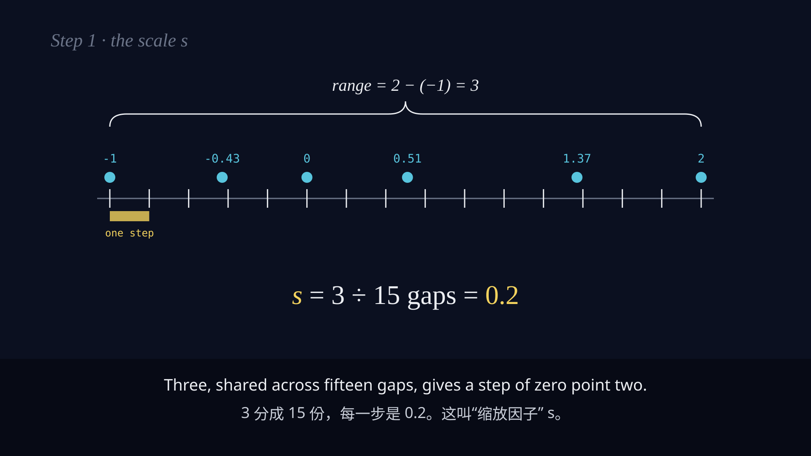

# 3b1b-math-explainer

A Claude Code skill for making **3Blue1Brown-style math explainer videos** with [HyperFrames](https://hyperframes.heygen.com):
dark chalkboard look, colour-coded step-by-step equations, worked examples by hand, AI narration,
burned-in **bilingual EN / 中文 subtitles**, varied scene transitions and a light music bed — rendered to MP4.



## What it does

`SKILL.md` walks an agent through the whole pipeline, with a user checkpoint at each stage:

1. **Brief**: length, format and voice.
2. **Script**: `SCRIPT.md` with one line per scene, English narration and 中文 subtitle text.
3. **Sketches**: a static storyboard sheet (`storyboard.html`) for approval.
4. **Voice**: OpenAI TTS, then Whisper word timings and a transcript-vs-script check.
5. **Subtitles**: hand-paired EN/中文 cues, auto-timed, numbers shown as digits, exported as `.srt`.
6. **Scenes**: one HyperFrames sub-composition per line, built in parallel from time-coded packets.
7. **Music**: a looped bed carved under the voice.
8. **Preview → render**.

## Install

```bash
git clone https://github.com/zyziyun/3b1b-math-explainer ~/.claude/skills/3b1b-math-explainer
pip install fonttools brotli
```

It also needs the HyperFrames skills and CLI, `ffmpeg`, an `OPENAI_API_KEY`, and optionally the HeyGen CLI for music.
Fonts aren't bundled. Download **STIX Two Text** and **Noto Sans SC** (both OFL) from Google Fonts and subset the CJK
font with `scripts/subset_cjk_font.py`.

## Example: model quantization (10:33, 18 scenes)

`examples/quantization/` contains the script, storyboard, all 18 scene compositions, the scene config with transitions and
shot sequences, and the bilingual `.srt` files. Audio, fonts and the rendered MP4 aren't included: the voice is regenerated
from `SCRIPT.md`, and the music is HeyGen-catalog licensed.

## Layout

```
SKILL.md                    the playbook the agent follows
scripts/                    tts, concat_vo, align_cues, display_en, scene_windows, make_packets,
                            make_captions, make_index (transitions), make_bgm_bed, subset_cjk_font
references/                 design-truth (frame.md template), frame-worker-dispatch, transitions, pitfalls
assets/reference-scene.html a known-good scene to copy
examples/quantization/      full worked example
```

## License

MIT. See `LICENSE`.
