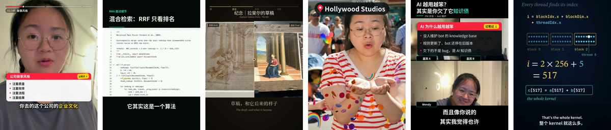

<p align="center">
  <a href="README.md">English</a> · <b>简体中文</b> · <a href="README.fr.md">Français</a> · <a href="README.es.md">Español</a>
</p>

<p align="center">
  <picture>
    <source media="(prefers-color-scheme: dark)" srcset="docs/brand/wordmark-on-dark.svg">
    
  </picture>
</p>

<p align="center"><b>一条素材，千条成片，一次发到各个平台。</b><br>
免费开源的视频工具，给需要批量剪辑的人用。</p>

<p align="center">
  <a href="https://reelfold.com/docs/zh/">使用文档</a> ·
  <a href="https://github.com/zyziyun/reelfold/releases/latest">下载 macOS 版</a> ·
  <a href="https://reelfold.com/zh/">官网</a> ·
  <a href="LICENSE">MIT</a>
</p>

- **说一句，放素材。** 用大白话说清楚要什么，千剪规划选段，在你自己的 Mac 上并行剪辑。
- **只审例外。** 每个文件自动质检，你只看被标出来的那几条。
- **每个平台各按各的规格。** 20 个平台，各自的尺寸、字幕位置、响度、封面和文案。发布是辅助式的：千剪帮你填好上传页，
  发布按钮由你自己点。



## 安装

**Mac 版**（Apple 芯片，免费）：第一个正式版发布后（即将推出）从
[Releases](https://github.com/zyziyun/reelfold/releases/latest) 下载；在那之前可以
[从源码构建](https://reelfold.com/docs/zh/start/install-mac/)。

**Claude Code 技能**（同一套引擎，技能名仍是 `video-studio`）：

```bash
git clone https://github.com/zyziyun/reelfold ~/.claude/skills/video-studio
~/.claude/skills/video-studio/install.sh
cp ~/.claude/skills/video-studio/persona.example.yaml ~/.claude/skills/video-studio/persona.local.yaml
```

AI 用你已有的：Claude Code / Codex 登录、自己的 API key，或者本地模型。

**使用文档 → [reelfold.com/docs/zh](https://reelfold.com/docs/zh/)**

## 这样说就行

| 你想要 | 可以这样说 |
|---|---|
| 口播精剪 | 「把这个口播剪一下：去气口、去口头禅和重复，1.1 倍速，加字幕、记笔记、进度条，发小红书」 |
| 长课切片 | 「这个 70 分钟的课切成 3 条竖屏短视频，每条一个知识点，代码放大，带封面和发布文案」 |
| 播客切片 | 「从这个 Zoom 播客里找一段最有意思的 1 分钟，嘉宾遮脸、名字打码，竖屏」 |
| 卡点 vlog | 「迪士尼照片和片段剪一个快节奏卡点 vlog，DAY 标签、地点、音效、弹字，9:16」 |
| 一条发多平台 | 「同一条导出小红书 3:4、抖音、YouTube Shorts，各自的安全区和响度」 |

更多说法：[示例指令](https://reelfold.com/docs/zh/examples/)。

## 了解更多

[快速开始](https://reelfold.com/docs/zh/start/what-is-reelfold/) ·
[使用指南](https://reelfold.com/docs/zh/guides/talking-head/) ·
[核心概念](https://reelfold.com/docs/zh/concepts/projects/) ·
[参考](https://reelfold.com/docs/zh/reference/) ·
[常见问题排查](https://reelfold.com/docs/zh/help/troubleshooting/) ·
[参与贡献](https://reelfold.com/docs/zh/contributing/)

## 许可

MIT，包括桌面应用（`apps/desk`）、官网（`apps/site`）和文档（`apps/docs`）。字体和模型在安装时从上游下载，
遵循各自的许可（SIL OFL 1.1、Apache-2.0）。HTML 转视频的工作流基于 [HyperFrames](https://hyperframes.heygen.com)。

千剪的前身是 **video-studio**（技能和引擎）和 **Daycut / 日剪**（桌面应用）。已经装在 `~/.claude/skills/video-studio`
的技能照常可用，把远程地址改到新仓库即可：
`git -C ~/.claude/skills/video-studio remote set-url origin https://github.com/zyziyun/reelfold`。
