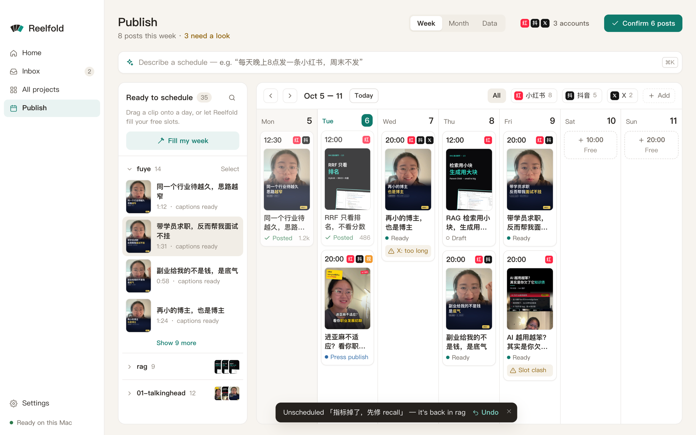

You get a posting calendar for the week, slots per account at the times you choose, and an assisted upload for each post: Reelfold opens the platform's own upload page, sets the video and types the title, text and tags. You check it, make the choices only you should make, and press publish yourself. Nothing is ever posted on its own.

## Before you start

- **Finished clips** that you approved, packaged per platform (see [One master, many platforms](/docs/guides/multi-platform/)).
- **Your publishing accounts** for each platform. One platform can have several accounts.
- The Mac app. The Claude Code skill can build packages and a schedule, but assisted upload runs in the app's built-in browser.

## Sign in to your accounts once

1. Open **Publishing accounts** in Settings (also reachable from the Publish page) and add each account: platform, a name like `@myhandle`, and its default post times, for example `12:00, 19:00`.
2. Press **Sign in**. The platform's own login page opens inside the app. Sign in there as you normally would.
3. The built-in browser keeps one persistent login per account on this Mac. The app never stores your password or cookies itself, and each account's state shows as signed in or signed out.

## Plan the week

The **Publish** page is a week board (also a month view):

- Finished clips wait in **Not scheduled**. Drag one onto a day, or into a free slot.
- **Let AI schedule** fills the free slots for you.
- Gaps show where an account has nothing planned on a day it should post.
- **Confirm this week** marks the scheduled posts as ready.

### Series

A series keeps a recurring show consistent: its recipe, settings, platforms, accounts and a cadence such as five posts a week. New projects in the series inherit all of that, and the calendar shows where the series falls behind.

## Publish a post

1. On the board, open a post and choose **Open assisted fill**. The platform's upload page opens in the built-in browser, signed in as that account.
2. Reelfold sets the video file and types the title, text and tags where the page allows it.
3. You check everything and make the choices that are yours: category, audience, the AI-content label, a subreddit, a Pinterest board. On B站, for example, the 分区 and 自制 / 转载 are never pre-filled.
4. You press publish. The app may outline the button; it never clicks it.
5. Back on the board, **Mark as posted** and paste the post's URL.

### When a platform asks you to sign in again

Logins expire. When the upload page turns out to be a login page, the fill stops there and the account shows as signed out.

1. Go to **Publishing accounts** and press **Sign in again** on that account.
2. Sign in on the platform's page in the built-in browser (password, QR code, whatever it asks).
3. Return to the post and open assisted fill again. Nothing you prepared is lost.

Assisted fill works for projects that have a publish package. If auto-fill isn't ready for a platform yet, open its upload page and use copy caption and show file instead.

## With the Claude Code skill

Claude can prepare everything up to the upload:

- `python -m vstudio.batch package --batch B --per-day 2 --start 2026-10-10 --times 12:00,19:00` writes per-platform folders, a `schedule.csv` and a confirmation code.
- The project calendar (`python -m vstudio.project calendar ...`) defines accounts with their post times, places exported clips in the next free slots, and lists gaps.
- Without the app, `uploader: manual` prints the upload page, the steps, `caption.txt`, the cover and a checklist for each post.

Official APIs are optional and off by default. Where you turn one on, every upload still needs the confirmation code of the exact package you reviewed.

## Options worth knowing

| Option | What it does |
|---|---|
| Default post times | Per account; new calendar slots use them. |
| Series cadence | Posts per week the calendar expects for the series. |
| Account tier | Some limits depend on it, for example X Premium. |
| AI label | Every Chinese platform, YouTube, TikTok and Meta have an AI-content toggle. You tick it; the checklist reminds you. |

## Example prompts

- "Schedule these 12 clips over the next two weeks: Xiaohongshu at noon, Douyin at 7 pm, one a day each."
- "Make 'Interview tips' a series that posts five times a week on my main Xiaohongshu account."
- "Open the upload page for tomorrow's Douyin post and fill it in."
- "What's missing from this week's calendar?"

## Related

- [Publishing](/docs/concepts/publishing/)
- [Publishing reference](/docs/reference/engine/publishing/)
- [Projects](/docs/concepts/projects/) and [projects reference](/docs/reference/engine/projects/)
- [One master, many platforms](/docs/guides/multi-platform/)
- [Privacy](/docs/concepts/privacy/)
