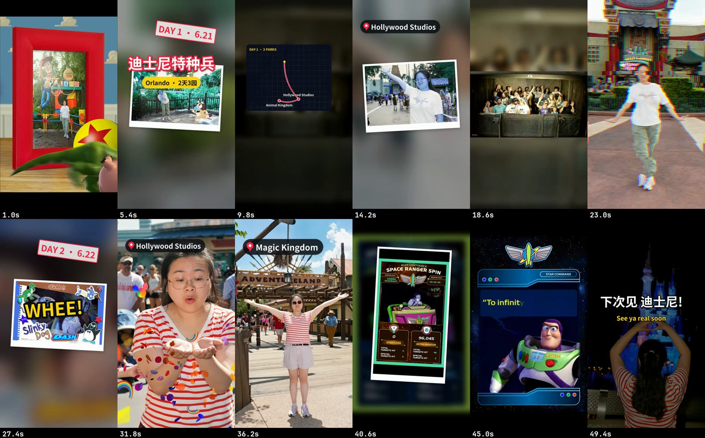

You get one polished vlog from a pile of clips: either **calm** (graded, gently sped up, long crossfades, music laid underneath) or **fun** (cut to the beat, speed ramps and slow-mo, whips, text pops, a route map, sound effects, and your talking-to-camera bits captioned over a ducked music bed). Both come with a cover.



## Pick a style

| | Calm | Fun |
|---|---|---|
| Feel | Slow crossfades, long holds, ambience, music laid on after | Cut to the beat, speed ramps, whips, text pops, sound effects |
| Footage | Drone, nature, walks; long smooth takes | Trips with many places, people, food, action; 60/120 fps clips; photos |
| Sound | Silent or ambient master, music added on top | Music-led: bed, sound effects, and speech clips with the music ducked under them |
| Length | 1 to 5 minutes, often horizontal 4K | 20 to 90 seconds, vertical first, also YouTube |
| Say | "calm", "cinematic", "slow", "healing" | "beat-cut", "fast", "fun travel reel" |

## Before you start

- **Your clips**, any size, landscape or portrait, SDR or iPhone HDR, 24 to 120 fps. Photos work too, mostly in the fun style.
- **For fun**: a music track with a clear beat that you have the rights to.
- **For calm**: a vibe for the music in your own words. Reelfold can fetch a CC BY track and writes the credit line you paste into the post.
- **Places and days**, if you want location tags, day stamps or a map.

If the video is mostly you talking, use [Talking-head shorts](/docs/guides/talking-head/) instead. A few talking-to-camera clips in a vlog are fine.

## In the Mac app

1. On Home, describe the vlog and add the clips. Say calm or fun and the platform.
2. The **plan** shows the style, the platform and the title.
3. **Windows and pacing.** Reelfold makes contact sheets of every clip (one tile every 4 seconds) so nothing is edited blind. The good windows, the order, the music, the title and the map go into one edit list. Ask the agent to draft it, then adjust.
4. The **batch** renders on your Mac. For the fun style it also writes a report: every cut with its beat check, transitions, overlays, the sound effects cue sheet and loudness.
5. **Pick the cover.**
6. Review and publish.

## With the Claude Code skill

Hand Claude the footage folder and say calm or fun. The skill follows `workflows/vlog`: it probes every clip, reads the contact sheets, writes `work/edit.json`, and renders. For fun it does a dry run first so you can read the plan.

```bash
python3 $VSTUDIO/workflows/vlog/scripts/probe.py footage/* --init work/edit.json --style fun \
    --music music/track.mp3 --platform xiaohongshu:full
python3 $VSTUDIO/workflows/vlog/scripts/build_fun.py work/edit.json --dry-run
```

## What each style does

**Calm.** HDR clips tone-mapped, a gentle grade, a speed per segment (scenery a little faster than subject shots), stabilise where it's shaky, crossfades with no black first frame and a fade-out at the end. Music is looped to fit, faded and normalised; with ambient sound kept, the place's sound sits under the music. The cover is a torn-paper scrapbook collage.

**Fun.** The music is analysed first and every cut lands on a whole beat. The edit opens on a hook of the best moments, then a title pop, then your shots in order, with a whip at each new place or day and a cut exactly on the music drop, then an accelerating finale and a slow outro. On top:

- speed ramps, true slow-mo from 120 fps clips, freeze-frames into a photo card;
- transitions: whip, zoom punch, flash, light leak, glitch (once), or a straight cut on the beat by default;
- text: title pop, location tags, DAY stamps, date stamps, word pops, a route map card, an end card, all inside the platform's safe area and never overlapping;
- sound effects (synthesised, nothing to license): whooshes on whips, impacts on drops, a riser into the finale, shutters on photos;
- speech clips: kept at 1×, cleaned of hesitations and long pauses, captioned, with the music ducked under them.

A version without music ships too, as a stem for re-scoring.

## Options worth knowing

| Option | Style | What it does |
|---|---|---|
| Platform | both | Sets canvas, fps, safe area, caption box and loudness. Default 小红书 9:16. |
| Grade, brightness | both | "Too dark" raises brightness, never adds a vignette. |
| Segment speed | calm | Per segment; persona defaults for subject and scenery shots. |
| Pace | fun | `fast` or `relaxed` (double length). |
| Music start, drops | fun | Where the music starts, and where the big cuts land. |
| Map, title, end card, word pops | fun | Turn each on or off. |
| Sound effects | fun | On by default; `sfx: false` turns them off. |
| Music level, duck amount | fun | Lower the bed, or duck it harder under speech. |
| Speech cleanup | both | Fun: gentle, automatic edits only by default. Calm: opt-in per segment. |

## Example prompts

- "Cut these drone clips into a calm 3-minute 4K vlog with soft music and a cover."
- "Fun travel reel for Xiaohongshu from this Tokyo trip, cut to this track. Add a map of the cities and a DAY stamp for each day."
- "Slow-mo the jump at the beach and put a whip into the night market."
- "Too fast. Make it relaxed and turn the music down under my talking bits."

## Related

- [Sound reference](/docs/reference/engine/sound/)
- [Aesthetics reference](/docs/reference/engine/aesthetics/)
- [Photo story](/docs/guides/photo-story/)
- [Covers](/docs/guides/covers/)
- [One master, many platforms](/docs/guides/multi-platform/)
- [vlog workflow reference](/docs/reference/workflows/vlog/)
- [Examples](/docs/examples/)
