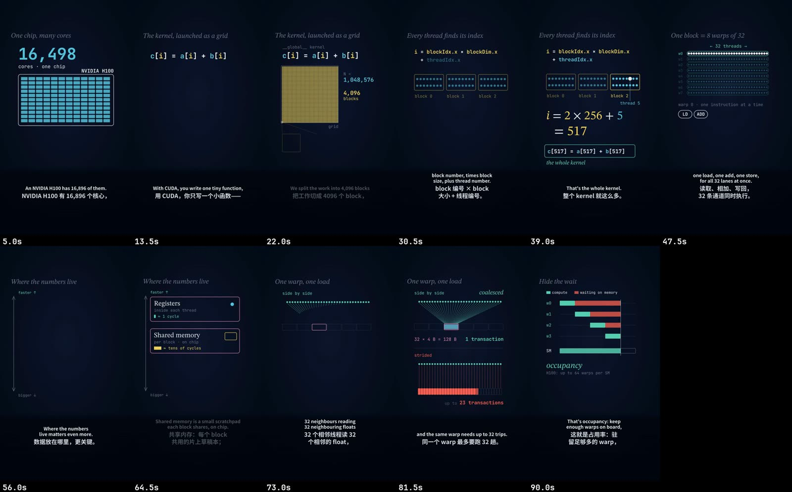

给千剪（Reelfold）一个选题，你会得到一条动画讲解视频：你确认过的脚本、AI 配音、彩色标注的动画场景、烧录的中英双语字幕和 `.srt` 文件、转场和轻柔的背景音乐。可以做成 5–12 分钟的 16:9 长片发 YouTube 或 B站，也可以做成 60–120 秒的竖屏短片发小红书、抖音、Shorts 或 TikTok。



## 开始之前

- **一个选题**，以及你想讲到的要点。已有的 `SCRIPT.md` 也可以直接用。
- **Node，并且 `npx hyperframes` 能跑。** 场景是用 [HyperFrames](https://hyperframes.heygen.com) 把 HTML 渲染成视频的，没有它就渲染不出来。
- **配音。** 默认用 OpenAI 的语音合成，需要 `OPENAI_API_KEY`（用 `gpt-4o-mini-tts` 大约每分钟旁白 0.015 美元）。
- **字幕字体**：`./install.sh` 会下载开源授权的字体（Noto Sans SC、STIX Two Text）。
- 可选：你自己的背景音乐文件。

这是最需要你参与的一种配方。脚本、分镜和字幕配对都会先起草好，但动画场景要由 AI 智能体（你的 Claude Code 或 Codex）来写，每一步都需要你看一眼。

## 在 Mac 应用里

1. 在首页的输入框里描述这条讲解视频：讲什么、给谁看、长片还是短片、发哪里。
2. 计划里会显示讲解视频配方、发布平台（第一个平台决定画布）、配音和长短。直接用一句话改。
3. 项目会在每个需要你拍板的地方停下，出现在收件箱里：
   - **锁定剧本。** 一个场景一句英文旁白，配一句中文字幕。数字按读出来的样子写。
   - **确认分镜。** 每个场景一帧，带时长和动效。
   - **选配音。** 选音色和语速，付费配音开始前先看到费用估算。
   - **检查字幕配对。** 英文分句和中文一一对应，可疑的配对会被标出来。
4. 场景搭好、预览、渲染，然后按平台导出，每个平台带封面和发布文案。

## 用 Claude Code 技能

跟 Claude 说要做一条讲解视频，技能会按 `workflows/explainer` 走。Claude 先问一次时长、发布平台和字幕排版，然后分阶段做，每个阶段停下来等你：

1. **脚本**（`SCRIPT.md`），先把例题里的每个数字核对一遍。
2. **草图**：每个场景画一张最完整那一刻的静帧，用真实的字体和配色。
3. **配音**：先给 10–15 秒试听，再生成全部旁白。每一条都会转写回来和脚本对比，漏了句子的会自动重生成。
4. **双语字幕**对齐到配音上。
5. **场景**用 HyperFrames 搭好，截帧检查，然后给你预览链接。你点头之后才正式渲染。

一个成片发多个平台：

```bash
python3 -m vstudio.export renders/short.mp4 --platforms xiaohongshu:full,douyin,youtube-shorts \
    --out exports/ --cover cover.png
```

## 长片还是竖屏短片

| | 16:9 长片 | 竖屏短片 |
|---|---|---|
| 时长 | 5–12 分钟，12–18 个场景 | 60–120 秒，5–8 个场景，每个不超过约 14 秒 |
| 结构 | 开场钩子 → 直觉 → 一道贯穿的例题 → 变体 → 总结 | 前 2 秒就是钩子 → 一张核心图 → 一道例题 → 一句话收尾 |
| 配音 | 每分钟约 175 个英文词 | 快 10% 左右，第一句更短 |
| 画布 | 1920×1080 | 9:16（`xiaohongshu:full`、`douyin`、`youtube-shorts`、`tiktok`）或 3:4（`xiaohongshu:vertical`） |

一次 9:16 的渲染可以同时发小红书全屏、抖音、Shorts 和 TikTok；3:4 要单独做一版。16:9 长片不会被裁成 9:16，否则公式和字幕会被裁掉。

## 值得了解的选项

| 选项 | 默认 | 作用 |
|---|---|---|
| 长短 | 长片 | `long`（5–12 分钟）或 `short`（60–120 秒）。 |
| 发布平台 | YouTube、B站 | 第一个平台决定画布和字幕区。 |
| 配音音色 | `cedar` | OpenAI TTS 音色，先试听再确认。 |
| 配音语速 | 1.0 | 0.7–1.4，短片一般用 1.1。 |
| 渲染质量 | standard | `draft`、`standard` 或 `high`。 |
| 背景音乐 | 自动 | 按主题挑一段安静的音乐，在人声下自动压低；也可以用你自己的文件。 |

## 示例指令

- 「做一条 3Blue1Brown 风格的讲解视频，讲模型量化是怎么回事，七分钟左右，发 YouTube 和 B站。」
- 「做一条竖屏短片讲 CUDA 在 GPU 上怎么跑，两分钟以内，英文配音、中文字幕。」
- 「按这份笔记的大纲来，例题从头到尾用同一组数字。」
- 「第 4 个场景太挤了，图放大一点，结果那一行往下挪。」

## 相关

- [explainer 工作流参考](/docs/zh/reference/workflows/explainer/)
- [封面和缩略图](/docs/zh/guides/covers/)
- [一个母版发多个平台](/docs/zh/guides/multi-platform/)
- [AI 服务](/docs/zh/concepts/ai-providers/)
- [效果参考](/docs/zh/reference/effects/)
