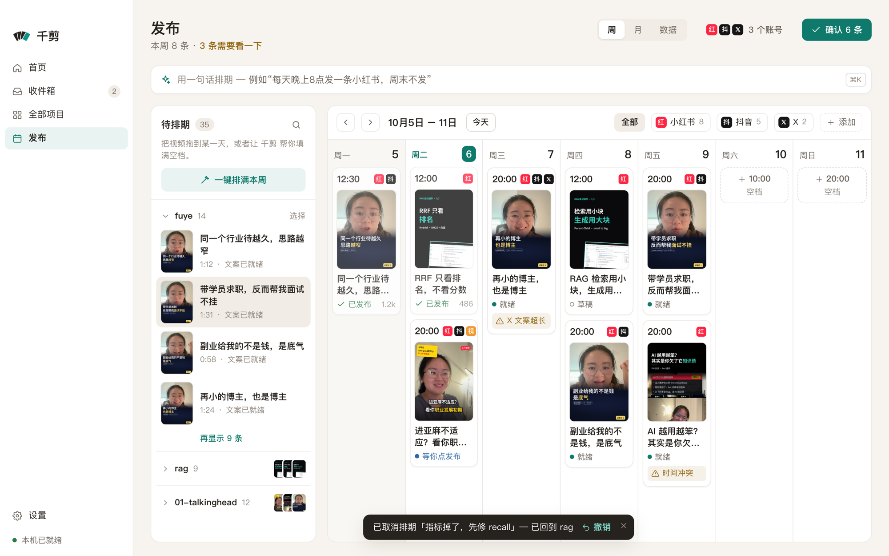

你会有一张这周的发布日历，每个账号按你定的时间留好发布位；每条帖子都有辅助上传：千剪（Reelfold）打开平台自己的上传页，放好视频，填好标题、正文和标签。你检查一遍，做只有你能做的选择，然后自己点发布。它从来不会自己发。

## 开始之前

- **已经通过、按平台打好包的成片**（见[一个母版发多个平台](/docs/zh/guides/multi-platform/)）。
- **每个平台的发布账号**。一个平台可以有好几个账号。
- Mac 应用。Claude Code 技能能做发布包和排期表，但辅助上传要在应用的内置浏览器里进行。

## 账号只登录一次

1. 在设置里打开 **发布账号**（发布页也能进），逐个添加：平台、名字（比如 `@我的号`）和默认发布时间，比如 `12:00, 19:00`。
2. 点 **登录**，平台自己的登录页会在应用里打开，像平时一样登录。
3. 内置浏览器会在这台 Mac 上为每个账号保留登录状态。应用本身不保存你的密码或 cookie，每个账号会显示已登录或已退出。

## 排好这一周

**发布** 页是一张周历（也可以切到本月视图）：

- 做好的片子在 **还没排的** 里等着，拖到某一天或某个空位上。
- **AI 帮我排** 会帮你把空位填上。
- 某个账号该发却没排的那天，会显示成断档。
- **确认本周排期** 把排好的帖子标记为就绪。

### 系列

系列让一档固定栏目保持一致：配方、参数、平台、账号，以及更新节奏，比如一周五条。系列里新建的项目会全部继承，日历上也能看出哪个系列落下了。

## 发一条帖子

1. 在周历上打开一条帖子，选 **打开辅助填写**。平台的上传页会在内置浏览器里打开，登录的就是这个账号。
2. 千剪放好视频文件，在页面允许的地方填好标题、正文和标签。
3. 你检查一遍，做属于你的选择：分区、受众、AI 生成内容声明、Reddit 的版块、Pinterest 的图板。比如 B站的分区和自制 / 转载，永远不会替你预选。
4. 你自己点发布。应用最多把按钮框出来，从不替你点。
5. 回到周历，点 **标记为已发**，贴上帖子链接。

### 平台要求重新登录时

登录会过期。打开的上传页其实是登录页时，自动填写会停在那里，账号显示为已退出。

1. 到 **发布账号**，在这个账号上点 **重新登录**。
2. 在内置浏览器里的平台页面登录（密码、扫码，按它的要求来）。
3. 回到那条帖子，再打开一次辅助填写。准备好的内容不会丢。

辅助填写适用于有发布包的项目。某个平台的自动填写还没做好的话，打开它的上传页，用「复制文案」和「显示文件」手动完成。

## 用 Claude Code 技能

Claude 可以把上传之前的事全部做好：

- `python -m vstudio.batch package --batch B --per-day 2 --start 2026-10-10 --times 12:00,19:00` 生成按平台分的文件夹、`schedule.csv` 和确认码。
- 项目日历（`python -m vstudio.project calendar ...`）可以设账号和发布时间，把导出的片子放进下一个空位，并列出断档。
- 不用应用的话，`uploader: manual` 会为每条帖子列出上传页、步骤、`caption.txt`、封面和一份检查清单。

官方 API 是可选的，默认关闭。即使你开启了，每次上传也都需要你审过的那个发布包的确认码。

## 值得了解的选项

| 选项 | 作用 |
|---|---|
| 默认发布时间 | 按账号设置，新的日历空位用这些时间。 |
| 系列节奏 | 日历期望这个系列每周发几条。 |
| 账号等级 | 有些限制和它有关，比如 X Premium。 |
| AI 标识 | 国内各平台、YouTube、TikTok 和 Meta 都有 AI 生成内容的开关。由你自己勾选，检查清单会提醒你。 |

## 示例指令

- 「这 12 条排到接下来两周：小红书中午、抖音晚上 7 点，各一天一条。」
- 「把『面试技巧』设成一个系列，在我的小红书主号上一周发五条。」
- 「打开明天那条抖音的上传页，帮我填好。」
- 「这周的日历还缺哪几天？」

## 相关

- [发布](/docs/zh/concepts/publishing/)
- [发布参考](/docs/zh/reference/engine/publishing/)
- [项目](/docs/zh/concepts/projects/) 和 [项目参考](/docs/zh/reference/engine/projects/)
- [一个母版发多个平台](/docs/zh/guides/multi-platform/)
- [隐私](/docs/zh/concepts/privacy/)
