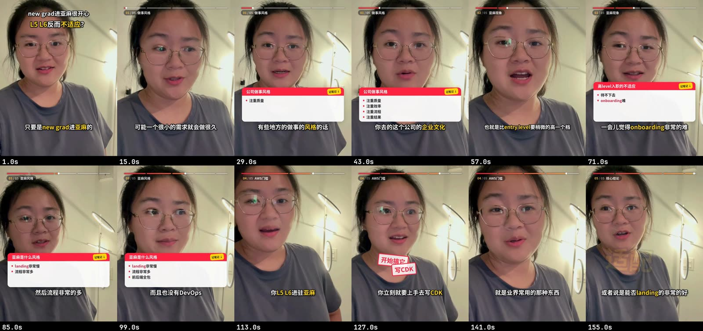

你会得到一条节奏紧凑的口播短视频：气口压短，口头禅、结巴和重复剪掉，整体略微加速，配好字幕，开头有高光预告（hook），中间有记笔记面板或关键词弹字，顶部有进度条，人像修过图，另附封面和发布文案。



## 开始之前

- **素材**：一段或几段竖屏手机口播（iPhone HDR 也可以），或一段横屏摄像头 / 相机录像。已经烧了字幕的横屏剪映导出也能用，但可选的风格更少。
- **几个常说的术语**：产品名、口播里夹的英文词。提前告诉千剪，转写更准。
- **B-roll（可选）**：录屏、截图或小片段，你说到某处时切过去，声音不断。

## 在 Mac 应用里

1. 在首页的输入框里说清楚要做什么，把素材拖进来。知道发哪个平台、想要什么风格，就一起说。
2. 千剪（Reelfold）先给出**方案**：用口播精剪流程、发哪些平台、语速多少、什么剪辑风格。哪里不对，直接用一句话改。
3. **批量**在你的 Mac 上跑：转写、去口癖、修图、字幕、排版、导出。
4. **审核**只在需要你的地方出现在收件箱：
   - **选 hook**：按推荐度排好的开场候选句，也可以不加。
   - **确认去 filler**：嗯、呃、结巴这类确定的已经删了；「那个」「就是」、说一半重来、重录的句子可能是正常用词，等你点头。可以按类型一次确认。
   - **选封面**：选一帧，定封面文字。
5. 确认导出。每个平台各有一份成片、封面和文案，发布时千剪打开平台自己的上传页并填好，最后由你按下发布。

## 用 Claude Code 技能

把文件夹交给 Claude，说你想要什么。技能会按 `workflows/talkinghead` 来做：

- 先读逐字稿，列出约 12 条编号的 hook 候选，每条标上类型（核心观点、反差、吐槽、共鸣、金句、悬念），再推荐几种组合。用哪几条、什么顺序，你来定。
- 跑统一的去口癖工具，给你一张审阅单。你回一句就行，比如 `确认 3,5,9 / 保留 7`。剪完会重新转写一遍，确认没有误删实词。
- 问你要哪种风格，先出几张预览静帧，再完整渲染。

这套去口癖工具也可以单独用在任何录音上：

```bash
python -m vstudio.cleanup analyze talk.mp4 --profile standard
python -m vstudio.cleanup apply cleanup.json --reply "确认 3,5,9 / 保留 7"
python -m vstudio.cleanup verify talk.clean.<tag>.mp4
```

## 剪辑风格

| 风格 | 效果 |
|---|---|
| 记笔记风 | 经典进度条、气泡、记笔记面板、hook 角标。节奏平稳，干货密，适合截图收藏。 |
| 精剪风 | 推拉节奏、关键词弹字、红色印章、圆形和卡片场景、音效、精致进度条。快而有冲击力。 |
| 混合 | 精剪节奏，加上两三个最值得记的要点用记笔记面板。 |

之后想换风格，只需要重新渲染一次。

## 竖屏手机素材 vs 横屏摄像头

- **竖屏手机素材**直接上 9:16 画布（HDR 先转成 SDR）。
- **横屏摄像头 / 相机录像**会跟着人脸重构成 9:16：平滑的虚拟镜头、带死区的缓动平移，眼睛大约在画面上三分之一处，并保持在平台安全区内。找不到人脸就用模糊背景填充。推镜头有上限，放大后的画面不会发虚。也可以保留 16:9 发 YouTube 或 B站，用横屏版式：面板和气泡放在远离人脸的一侧。

## 值得知道的选项

| 选项 | 默认 | 作用 |
|---|---|---|
| 引擎 | fast | 应用里 `fast` 负责去口癖和字幕；完整风格引擎再加上风格、跟脸、面板和进度条。 |
| 正文语速 | 1.1× | 保持音调。中文大约 1.4× 以内都听得清。 |
| hook 语速 | 1.3× | 开场高光比正文稍快。 |
| 去气口力度 | standard | `gentle` / `standard` / `tight`。气口只压短，不会整段删掉。 |
| 剪辑风格 | 混合 | 记笔记 / 精剪 / 混合（见上）。 |
| 高亮关键词 | 无 | 在字幕里用高亮色显示的词。 |
| 修图 | 自然妆、低强度 | 瘦脸、眼睛、去油光、磨皮、淡妆。妆容可以关掉。 |
| B-roll | 无 | `cut` 整屏切走、`pip` 角落小窗、`split` 上下分屏。长截图会滚动或逐行高亮。你的声音一直在。 |
| 平台 | 小红书 9:16 | 也支持小红书 3:4、抖音、TikTok、Shorts、YouTube、B站。 |

## 示例指令

- 「把这三段 iPhone 口播剪成一条小红书，记笔记风，去气口去口头禅，开头加 hook，做个封面。」
- 「这是摄像头录的横屏，出一版竖屏发抖音和视频号，再留一版 16:9 发 B站。」
- 「换成精剪风，再快一点，讲到后台那段切到我的录屏。」
- 「hook 换成讲入职那句，封面字再短一点。」

## 相关

- [批量与审核](/docs/zh/concepts/batch-review/)
- [修改成片](/docs/zh/concepts/output-edits/)
- [封面](/docs/zh/guides/covers/)
- [一个母版发多平台](/docs/zh/guides/multi-platform/)
- [去口癖参考](/docs/zh/reference/engine/cleanup/)、[修图参考](/docs/zh/reference/engine/retouch/)
- [talkinghead 流程参考](/docs/zh/reference/workflows/talkinghead/)
- [案例](/docs/zh/examples/)
